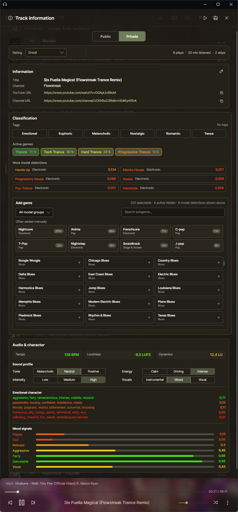
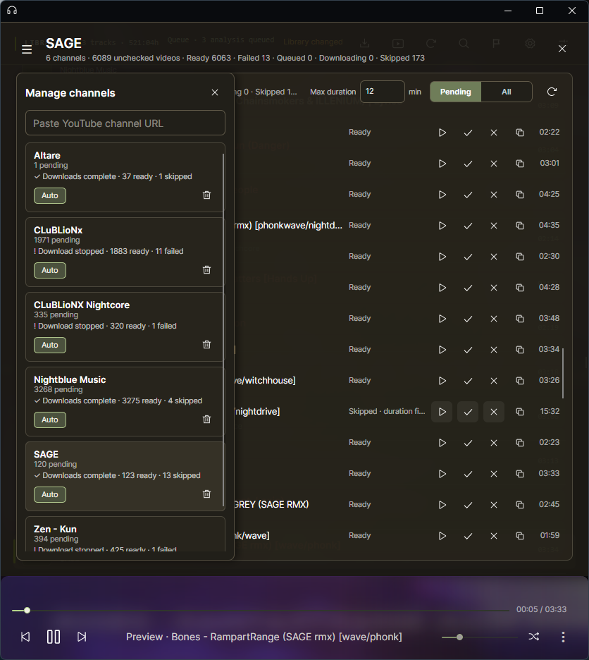
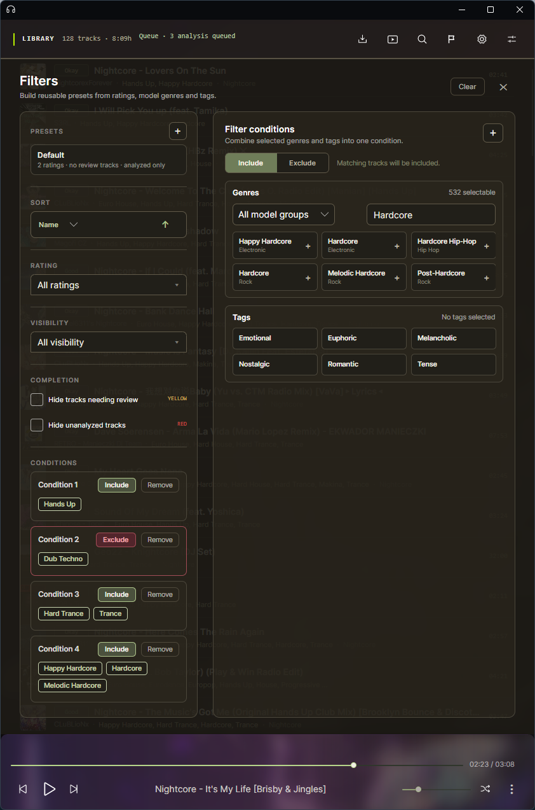

# Resona

Resona is a local-first desktop app for building, analyzing, and curating a personal music library.

It combines playback and library management with background imports from YouTube videos, playlists, mixes, and radio links. Imported tracks can be analyzed with Essentia-based models to suggest genres and extract information such as BPM and loudness.

The library can be searched, filtered, rated, tagged, and manually refined. Resona also supports model-review workflows, local database backups, and portable Android library exports.

## Linux

Linux x64 releases are available as an AppImage. Playback uses the system `libvlc`; imports and video export rely on `yt-dlp`, FFmpeg, FFprobe, and Node.js. Missing runtime dependencies are shown in the app settings, and desktop media controls are supported through MPRIS.

## Screenshots

