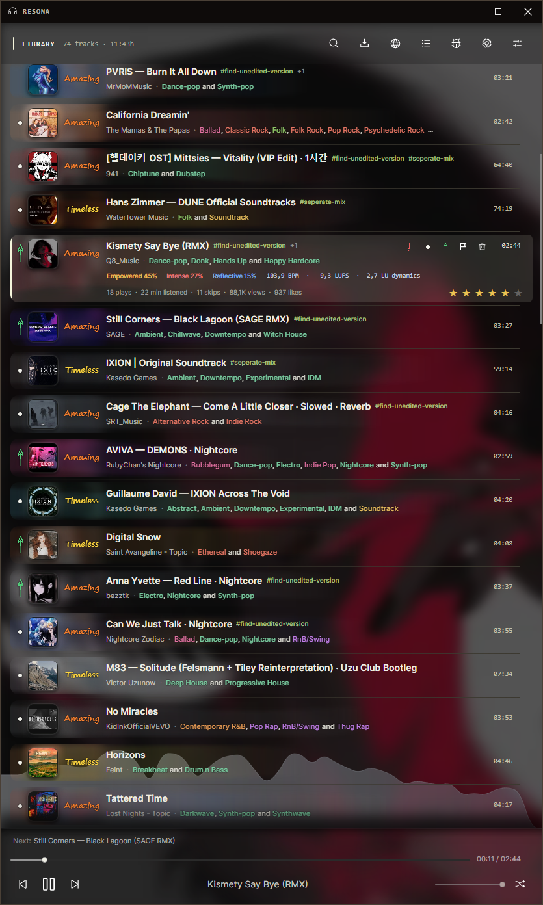

# Resona

**Your music, your library, your decisions.**

Resona is a server-backed, local-first music library for people who want to collect, understand, and curate their music instead of handing that job to a streaming service. The self-hosted server is the authoritative library and performs new downloads and analysis. Windows, Linux, and Android keep fast local metadata caches and can retain audio for offline playback.

Paste a YouTube video, playlist, mix, or radio link and Resona expands it into a persistent import queue. New tracks can be analyzed with Essentia-based models for genre suggestions, BPM, loudness, dynamics, and emotional character. Ratings, tags, languages, styles, collections, presets, and reusable views make even a large library manageable without taking control away from you.

Resona also includes a dedicated track editor, channel discovery, public profiles, Discord Rich Presence, review workflows, artwork-driven visuals, local database backups, and private desktop-to-Android synchronization. The cloud component is self-hosted: metadata and audio are stored on infrastructure you control.

## How the system fits together

- **Resona Desktop** owns and edits the library.
- **Resona Cloud API** stores the shared, revisioned library, uploaded audio, presets, and server download jobs.
- **Resona Analyzer** processes audio for the desktop app.
- **Resona Android** reads the synchronized snapshot and downloads missing tracks for offline playback.

Clients merge newer server metadata into their local cache before uploading local changes. Track and preset writes carry revision numbers, so a stale device receives a conflict instead of silently overwriting another device. Audio files are transferred individually. Android can download the entire missing library or keep/remove individual tracks according to available storage.

## Requirements

For the complete self-hosted setup you need:

- a Windows or Linux computer for Resona Desktop;
- a Linux server with Git, Docker Engine, and Docker Compose;
- sufficient server storage for PostgreSQL and the complete audio library;
- a hostname or IP address reachable by the desktop and Android devices;
- HTTPS with a publicly trusted or device-trusted certificate;
- Android Platform Tools if the APK will be installed through ADB.

A public server is not required. A home server, NAS, VPN host, or private network is sufficient as long as both devices can reach it and trust its TLS certificate. The included containers bind their ports to localhost, so remote access should go through nginx, Caddy, or another reverse proxy.

## 1. Deploy the server

Clone the repository on the server:

```bash
git clone https://github.com/bezztk/resona.git
cd resona/deploy/cloud
```

Create the environment file and choose a strong PostgreSQL password:

```bash
cp .env.example .env
nano .env
```

The default configuration looks like this:

```dotenv
POSTGRES_DB=resona
POSTGRES_USER=resona
POSTGRES_PASSWORD=replace-with-a-long-random-password
RESONA_API_PORT=5080
RESONA_ANALYZER_PORT=5081
MAX_CONCURRENT_ANALYSES=1
ANALYSIS_TIMEOUT_SECONDS=1800
MAX_UPLOAD_BYTES=1073741824
MUSIC_API_KEY=replace-with-an-optional-analyzer-key
```

`MUSIC_API_KEY` protects the analysis endpoint. If it is set here, enter the same value in Resona Desktop. Leave it empty on both sides if the analyzer is only reachable through a trusted private network.

Build and start PostgreSQL, the Cloud API, and the Analyzer:

```bash
docker compose up -d --build
docker compose ps
```

Verify the local container endpoints:

```bash
curl http://127.0.0.1:5080/health
curl http://127.0.0.1:5081/health
```

Both requests should return a successful health response. Detailed server documentation and API endpoints are available in [deploy/cloud/README.md](deploy/cloud/README.md).

## 2. Configure HTTPS and nginx

Using separate hostnames keeps the reverse-proxy configuration simple:

- `api.example.com` → Resona Cloud API on `127.0.0.1:5080`
- `analyzer.example.com` → Resona Analyzer on `127.0.0.1:5081`

An nginx configuration can look like this:

```nginx
server {
    listen 443 ssl http2;
    server_name api.example.com;

    client_max_body_size 256m;

    location / {
        proxy_pass http://127.0.0.1:5080;
        proxy_http_version 1.1;
        proxy_set_header Host $host;
        proxy_set_header X-Forwarded-For $proxy_add_x_forwarded_for;
        proxy_set_header X-Forwarded-Proto $scheme;
        proxy_request_buffering off;
        proxy_read_timeout 1800s;
        proxy_send_timeout 1800s;
    }
}

server {
    listen 443 ssl http2;
    server_name analyzer.example.com;

    client_max_body_size 1g;

    location / {
        proxy_pass http://127.0.0.1:5081;
        proxy_http_version 1.1;
        proxy_set_header Host $host;
        proxy_set_header X-Forwarded-For $proxy_add_x_forwarded_for;
        proxy_set_header X-Forwarded-Proto $scheme;
        proxy_request_buffering off;
        proxy_read_timeout 1800s;
        proxy_send_timeout 1800s;
    }
}
```

Add the normal certificate directives for your environment, test the configuration, and reload nginx:

```bash
sudo nginx -t
sudo systemctl reload nginx
```

The API limit of 256 MB is important. Without `client_max_body_size 256m`, nginx can reject audio synchronization with HTTP 413. Only ports 80 and 443 need to be public; the Docker ports remain bound to `127.0.0.1`.

After configuring TLS, verify the public addresses:

```bash
curl https://api.example.com/health
curl https://analyzer.example.com/health
```

## 3. Connect Resona Desktop

Open **Settings → Servers** in the desktop app:

1. Set **Cloud synchronization → Server address** to `https://api.example.com`.
2. Set **Analysis server → Server address** to `https://analyzer.example.com`.
3. If `MUSIC_API_KEY` is configured on the server, enter the same value in **API key**.
4. Save or test the analyzer configuration.

Then open **Settings → Cloud sync**:

1. Select **Synchronize now**.
2. Watch **Local audio**, **In cloud**, and **Pending** during the initial upload.
3. Leave the desktop app running until the desired files have been uploaded.

Resona also starts synchronization automatically and requests another synchronization after relevant library changes. The first upload may take a long time for a large collection; subsequent runs merge current metadata and transfer only audio that is still missing on the server. With a cloud server configured, new desktop downloads are queued on the server, where yt-dlp, FFmpeg, and the analyzer process them.

The Cloud API creates its database schema automatically. PostgreSQL data is stored in the `postgres-data` Docker volume, while uploaded audio is stored in `resona-media`. Back up both before server migrations or destructive maintenance.

## 4. Install and connect the Android app

Download or build the signed APK and enable USB debugging on the Android device. With Android Platform Tools installed:

```bash
adb devices
adb install -r com.beran.music.v2-Signed.apk
```

`adb devices` must list the phone as `device`. Confirm the debugging authorization dialog on the phone if it appears. The `-r` option updates an existing installation without intentionally removing its app data.

To connect Android to your private library:

1. In Resona Desktop, open **Settings → Cloud sync**.
2. Select **Copy Android server URL**.
3. Open the cloud section in Resona Android.
4. Paste the URL and connect the device.
5. Select **Sync metadata & presets**. On later launches, the cached library opens immediately and this check runs automatically in the background.
6. Review the number and size of missing tracks, then start **Download missing audio**.

The private server exposes one shared library to devices on your home network or VPN. Android only stores the server URL; it can edit shared track metadata and presets with conflict protection, submit server downloads, and choose which tracks remain offline on the phone.

For a server inside the home network, the phone must be connected to that network or VPN. Do not use `localhost` as the Android server address: on the phone, `localhost` refers to the phone itself.

## Updating the server

Pull the latest repository state and rebuild the containers:

```bash
cd /path/to/resona
git pull
cd deploy/cloud
docker compose up -d --build
docker compose ps
```

Docker keeps the named PostgreSQL and media volumes when containers are rebuilt. This is not a substitute for backups.

## Linux

Linux x64 releases are available as an AppImage. Playback uses the system `libvlc`; imports rely on `yt-dlp`, FFmpeg, FFprobe, and Node.js. Resona reports missing runtime dependencies in Settings and integrates with desktop media controls through MPRIS.

## Screenshots

### Your library at a glance

Browse, play, rate, and manage the collection from the central library view.



### Make every track your own

Edit metadata, ratings, classifications, language, and analysis results in one focused view.


### Find the exact mood

Combine ratings, genres, styles, tags, languages, visibility, and emotional character.


### Import an entire playlist from one URL

Paste a YouTube playlist, mix, or radio link, review the expanded track list, and send the selection into the persistent import queue.


### Discover through channels and profiles

Follow channels represented in your library and discover public collections shared by other Resona profiles.


### Review before a track joins the library

Inspect channel tracks, download interesting finds, and make the final decision yourself.


### Tune Resona to your environment

Configure playback, analysis, cloud synchronization, appearance, backups, integrations, and external tools.


