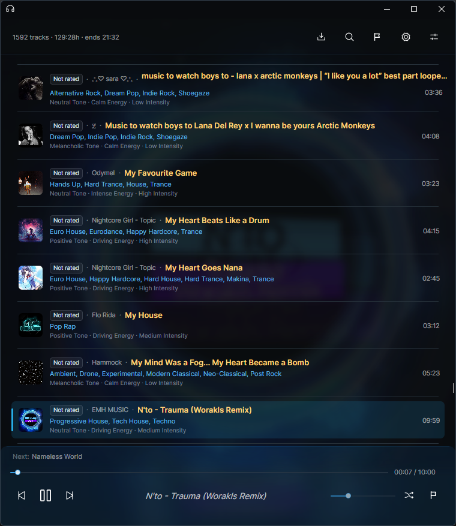
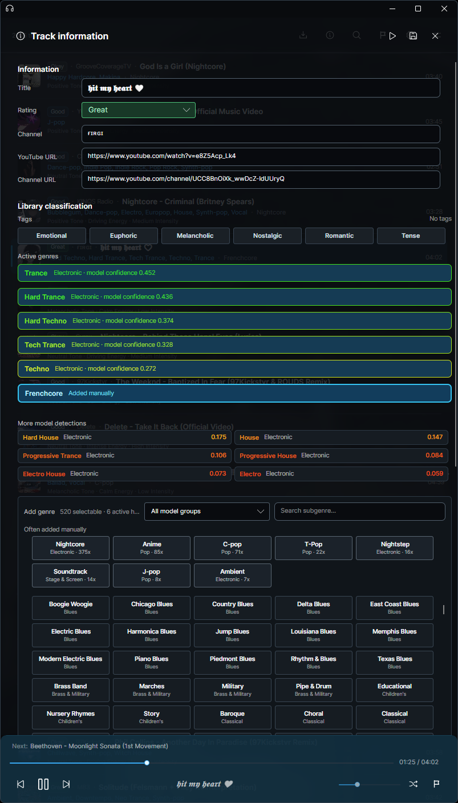
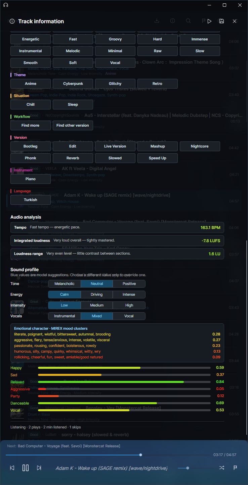

# Music

Music is a local desktop app for building, analyzing, and curating a personal music library.

It can import tracks from YouTube videos, playlists, mixes, and radio links, show a preview before queueing, and download the selected tracks in the background. After import, the app automatically runs audio analysis using multiple Essentia-based models to suggest genres, detect BPM, measure loudness, and build sound profile data.

The app is built around everyday library work: listening, searching, filtering, rating tracks, reviewing model suggestions, adding genres and tags, marking songs for review, and keeping large imports manageable. It also includes local database backups and a portable Android library export.

## Screenshots

