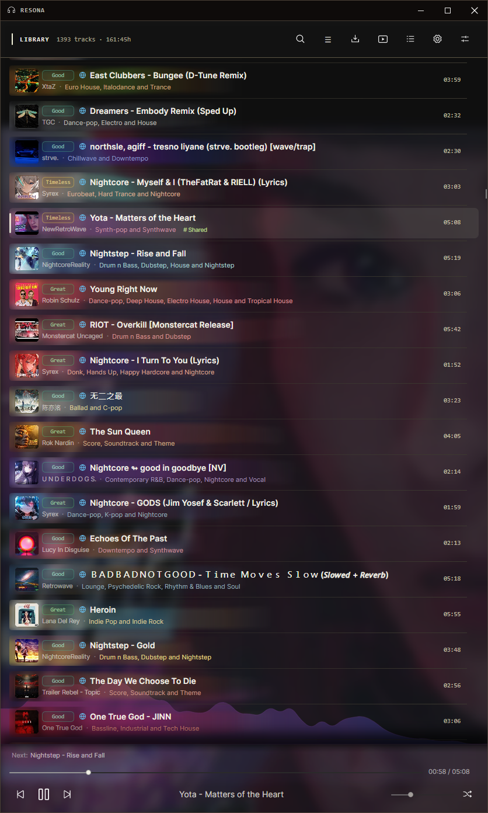
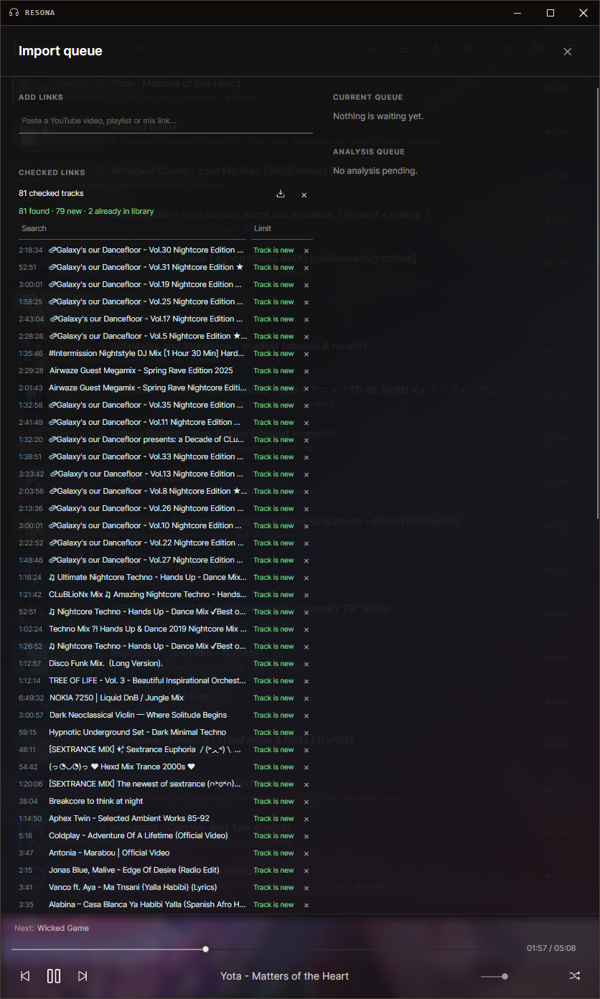
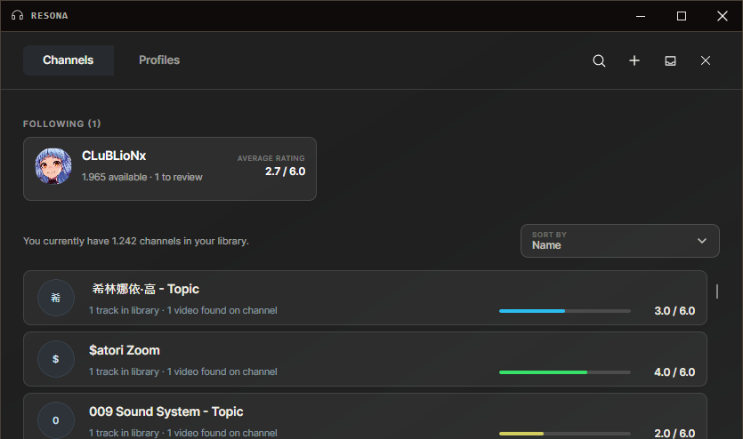
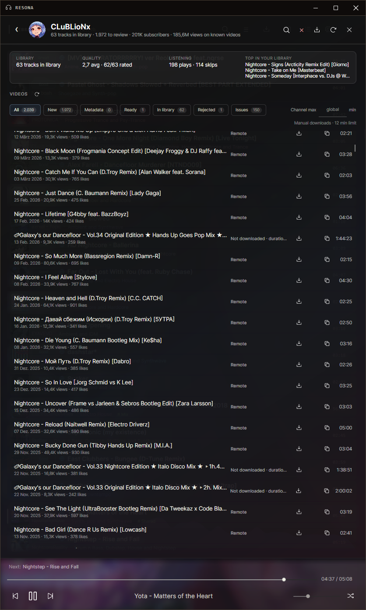
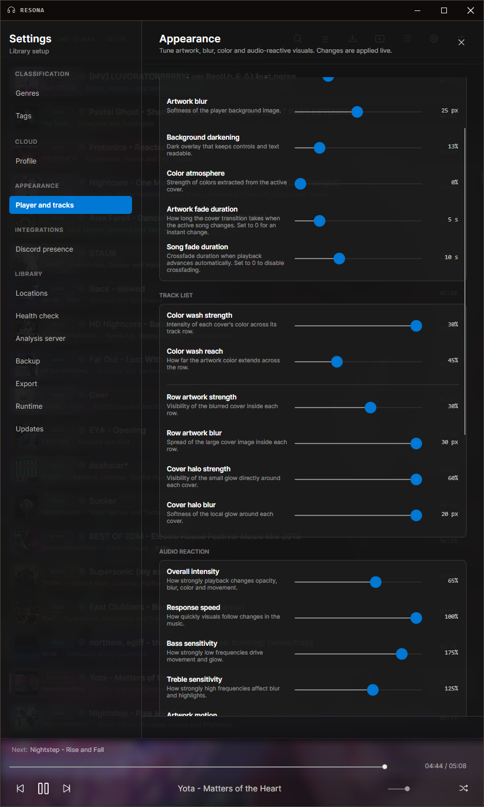

# Resona

**Your music, your library, your decisions.**

Resona is a local-first desktop music app for people who want more than a folder full of audio files. It brings playback, discovery, analysis, and careful library curation together in one place—while your music and your personal data remain under your control.

Add a YouTube video, playlist, mix, or radio link and Resona takes care of the routine work. Tracks are downloaded through a persistent queue and can be analyzed with Essentia-based models for genre suggestions, BPM, loudness, dynamics, and emotional character. You decide what belongs in your library, how it should be rated, and how it should be organized.

Once the collection grows, powerful filters, tags, languages, ratings, and the dedicated track editor make it easy to find exactly the right sound. The Channel Hub follows artists and channels already represented in your library, while public Resona profiles offer another way to discover music through people you know.

Resona also includes artwork-driven visuals, Discord Rich Presence, review workflows, local database backups, portable Android library exports, and a self-hostable cloud service. Cloud data is used for discovery; downloads still follow the normal local import and analysis pipeline.

## Linux

Linux x64 releases are available as an AppImage. Playback uses the system `libvlc`, while imports rely on `yt-dlp`, FFmpeg, FFprobe, and Node.js. Resona reports missing runtime dependencies in the settings and integrates with desktop media controls through MPRIS.

## Screenshots

> Resona is evolving quickly. A few details in these screenshots may differ from the current interface, and updated images are coming soon.

### Your library at a glance

Browse, play, rate, and manage the collection from the central library view.

### Make every track your own

Edit metadata, ratings, classifications, language, and analysis results in one focused view.

### Find the exact mood

Combine ratings, genres, tags, languages, visibility, and emotional character ranges.

### One URL, an entire playlist

Paste a YouTube playlist, mix, or radio-playlist URL and Resona expands it into individual tracks before anything is downloaded. Review the full list, remove anything you do not want, and then send the selection into the normal import queue—all from a single link.

### Discover through channels

Follow channels already connected to your library and keep an eye on new uploads.

### Review before it joins the library

Inspect channel tracks, download interesting finds, and make the final decision yourself.

### Tune Resona to your setup

Configure playback, analysis, appearance, backups, cloud access, integrations, and external tools.

